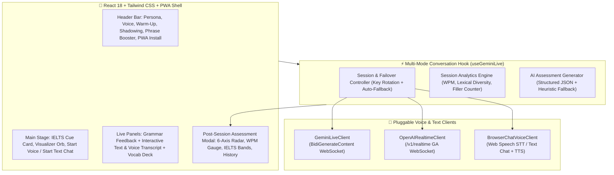

# 🎙️ SpeakAI Coach — Real-Time AI English Speaking & Text Coach

<div align="center">

**English** | **[فارسی (Persian)](README.fa.md)**

[](https://mohsen-niksirat.github.io/SpeakAI-Coach/)
[](https://mohsen-niksirat.github.io/SpeakAI-Coach/)
[](LICENSE)
[](https://github.com/mohsen-niksirat/Leitner-Pro-Max)

**Practice English speaking and text conversation with an intelligent AI coach.**  
Speak over ultra-low-latency WebSocket audio or chat via text, receive live grammar/pronunciation corrections and vocabulary flashcards, practice shadowing, and get a comprehensive **6-dimension graphical assessment report & IELTS band estimate** at the end of every session.

</div>

---


---

## ✨ Key Features

### 🗣️ 1. Three Flexible Conversation Modes (Voice + Hybrid + Text Chat)
- **Ultra-Low-Latency Native Voice (`Gemini Live` & `OpenAI Realtime`)**: True bidirectional speech-to-speech over WebSockets (`/v1/realtime` GA & `BidiGenerateContent`) with natural **barge-in** (interrupt the coach at any moment).
- **Browser Voice + Chat (`STT → LLM → TTS`)**: Use any text/chat provider (**Groq**, **OpenRouter**, **Cerebras**, **GitHub Models**, **SambaNova**, **Mistral**, **Cohere**) as a full voice coach using browser Speech Recognition and native Speech Synthesis.
- **Interactive Text Chat (`💬 Text Chat`)**:
  - Start a dedicated **Text Chat Session** without needing a microphone, or type messages right alongside your voice during a live call.
  - Includes **Quick Coaching Prompt Chips**, instant Enter-to-send, 1-click native TTS playback (`🔊`), live grammar corrections, and vocabulary extraction.

### 📊 2. Multi-Dimensional Post-Session Assessment Dashboard
Whenever a session ends (or you manually hang up), SpeakAI Coach generates an interactive **Assessment Report** featuring:
- **6-Axis Skill Radar Chart (SVG)**: Visualizes your **Pronunciation & Accent**, **Fluency & Rhythm**, **Grammatical Accuracy**, **Lexical Diversity**, **Speed & Pacing**, and **Coherence & Task** on a `0–100` scale.
- **Official 4-Criteria IELTS Band Estimation**: Individual band scores (`1.0–9.0`, `0.5` steps) and examiner commentary for *Fluency & Coherence*, *Lexical Resource*, *Grammatical Range & Accuracy*, and *Pronunciation*.
- **Speech Speed (WPM) Gauge**: Compares your Words-Per-Minute against the ideal native/IELTS target zone (`110–150 WPM`).
- **Talk-Time Balance & Discourse Metrics**: Tracks user vs. coach speaking share, unique vocabulary ratio (type-token diversity), average words per turn, and filler word usage (`um, uh, like, you know...`).
- **Categorized Mistake Review & Session Flashcards**: Side-by-side comparison of what you said/typed (`❌`) vs. the natural native alternative (`✅`) with 1-click audio pronunciation.

### 🎭 3. Eight Specialized Coach Personas
1. **🎓 IELTS Examiner**: Realistic Part 1, Part 2 Cue Card, and Part 3 follow-up simulation.
2. **☕ Friendly Native Speaker**: Relaxed everyday conversation about life, culture, and hobbies.
3. **💼 Tech & HR Interviewer**: Behavioral (`STAR` method) and technical job interview prep.
4. **⚖️ Debate Partner**: Constructive sparring on thought-provoking topics.
5. **🎯 Shadowing Coach**: Sentence-by-sentence repetition drills focusing on rhythm and connected speech.
6. **🗣️ Pronunciation Drill Coach**: Minimal pairs (`ship/sheep`), syllable stress, and intonation practice.
7. **🌍 Real-World Situational Roleplay**: Airport immigration, hotel check-in, restaurant, doctor visit, or client negotiation.
8. **📖 Storytelling & Vocabulary Builder**: Narrative building, academic idioms, phrasal verbs, and collocations.

### 🛠️ 4. Built-in Speaking & Fluency Power Tools
- **IELTS Cue Card & Topic Simulator**: Curated topics across IELTS Part 1/2/3, Interviews, Debates, and Roleplays — plus **interactive 1-minute preparation & 2-minute speaking timers** and custom topic input.
- **Interactive Shadowing Lab (`🎯 Shadowing`)**: Listen to native sentences (or click **"Shadow"** on any message in the live transcript), record your repetition, and get an instant word-by-word accuracy diff and similarity score.
- **Daily Warm-Up Routine (`🔥 Warm-Up`)**: Guided tongue twisters, breathing exercises, and quick articulation drills before your session.
- **Phrase Booster (`✨ Phrases`)**: Role-tailored C1/C2 idioms, linking phrases, and collocations with instant audio preview.

### 🔑 5. Multi-Provider BYOK, Free Key Guide & Connection Tester
- **Built-in Free API Key Guide (`🎁 Free Keys`)**: Step-by-step interactive tutorial for obtaining free/recharging API keys from **Google AI Studio (Gemini)**, **Groq Cloud**, **OpenRouter**, **Cerebras**, **GitHub Models**, **Mistral La Plateforme**, and **Cohere**, with 1-click provider setup.
- **1-Click Connection & Key Tester (`Test Connection`)**: Verify individual API keys or test all keys in a pool before starting a call, with response latency (`ms`) and smart VPN/location diagnostics. Supports both `AIzaSy...` and `AQ.Ab8...` Google key formats.
- **Automatic Key Rotation & Smart Failover**: Attach multiple keys per provider; automatically rotates on `401/403/429` errors and seamlessly falls back to hybrid mode or secondary providers if WebSockets or regions are restricted.

### 📲 6. Installable Progressive Web App (PWA) & Leitner Export
- **Installable PWA**: Custom vector & adaptive maskable icons, `manifest.webmanifest`, offline-capable Service Worker (`sw.js`), and a 1-click **"📲 Install App"** button in the header for Android, iOS, Windows, and macOS.
- **1-Click Leitner-Pro-Max & Anki Export**: Export captured vocabulary flashcards directly to **[Leitner-Pro-Max](https://github.com/mohsen-niksirat/Leitner-Pro-Max)** JSON format, CSV, or Anki tab-separated decks.

---

## 🏗️ System Architecture



---

## 🚀 Live Demo & Local Setup

### 🌐 Try it Online
- **Standalone GitHub Pages**: [https://mohsen-niksirat.github.io/SpeakAI-Coach/](https://mohsen-niksirat.github.io/SpeakAI-Coach/)
- **Inside Leitner-Pro-Max**: [https://mohsen-niksirat.github.io/Leitner-Pro-Max/speakai/](https://mohsen-niksirat.github.io/Leitner-Pro-Max/speakai/)

### 💻 Local Development
```bash
npm install
npm run dev      # Start dev server at http://localhost:3000
npm test         # Run Vitest unit test suite
npm run build    # Type-check and build production bundle in dist/
```

---

## 🔌 Supported Provider Types

| Provider Type | Voice Mode | Text Chat Mode | Session Report | Example Base URL |
|---|---|---|---|---|
| **Gemini Live** | Native WebSocket Audio (+ Hybrid Fallback) | ✅ Supported | Gemini `generateContent` | `https://generativelanguage.googleapis.com` |
| **OpenAI Realtime** | Native WebSocket Audio (`/v1/realtime` GA) | ✅ Supported | OpenAI `chat/completions` | `https://api.openai.com/v1` |
| **OpenAI-Compatible** (Groq, OpenRouter, Cerebras, GitHub…) | Browser Voice (`STT → Chat → TTS`) | ✅ Supported | `chat/completions` | `https://api.groq.com/openai/v1` |

---

## ⚠️ Disclaimer

**This is an AI-based practice and self-assessment tool, not an official IELTS score.** Band scores and skill percentages are estimated from your session transcript and speaking metrics for educational practice only; official IELTS results are issued exclusively by certified test centers.

---

## 📄 License

Licensed under the [Apache License 2.0](LICENSE) — see [NOTICE](NOTICE).
